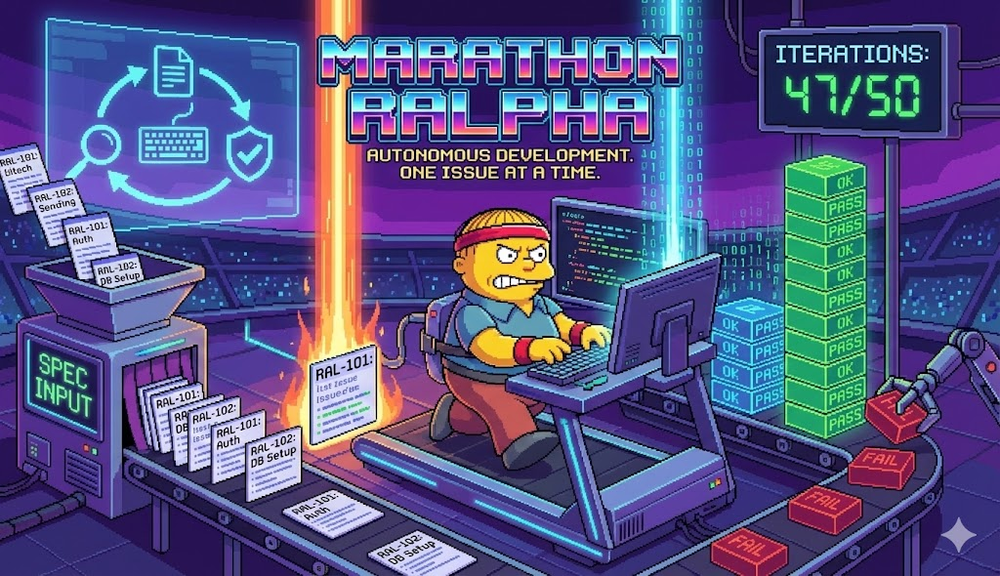

# Marathon Ralph



**Give it a spec file. Get a tested, working application.**

Marathon Ralph is a Claude Code plugin that autonomously builds applications from specification files. It creates a Linear project, breaks your spec into issues, and works through them one by one — writing code, tests, and E2E tests — until everything is done.

## Why This Exists

Building a full application requires managing dozens of tasks, maintaining quality across sessions, and ensuring every feature is tested. Marathon Ralph automates this entire workflow:

- **No task management** — Issues are auto-generated from your spec
- **No context loss** — Continues across sessions via Linear
- **No skipped tests** — Every feature gets unit, integration, and E2E tests
- **No broken builds** — Verification runs before each new feature

## Installation

```bash
# Add the marketplace
claude plugin marketplace add gruckion/marathon-ralph

# Install the plugin
claude plugin install marathon-ralph
```

## Quick Start

```bash
# 1. Start a marathon from your spec file
/marathon-ralph:run examples/todo_app_spec.md

# 2. Check progress anytime
/marathon-ralph:status

# 3. Stop if needed (preserves progress)
/marathon-ralph:cancel
```

That's it. The marathon runs autonomously until all issues are complete.

## Example Spec File

```xml
<project_specification>
  <project_name>Simple Todo App</project_name>
  <project_directory>simple-todo-app</project_directory>

  <overview>
    A minimal todo application with basic CRUD functionality.
  </overview>

  <technology_stack>
    <frontend>Next.js 15, Tailwind CSS, shadcn/ui</frontend>
    <backend>oRPC, Drizzle ORM, SQLite</backend>
  </technology_stack>

  <database_schema>
    <todos_table>
      - id: text (primary key)
      - text: text (required)
      - completed: integer (0 or 1)
    </todos_table>
  </database_schema>

  <api_endpoints>
    - todo.getAll: Get all todos
    - todo.create: Create todo
    - todo.delete: Delete todo
    - todo.toggle: Toggle completion
  </api_endpoints>

  <implementation_steps>
    <step number="1">Setup and Database</step>
    <step number="2">API Routes</step>
    <step number="3">UI Implementation</step>
  </implementation_steps>

  <success_criteria>
    - Can add, toggle, delete todos
    - Data persists in SQLite
    - No TypeScript errors
  </success_criteria>
</project_specification>
```

See `examples/` for full spec files. Marathon Ralph reads the spec, creates Linear issues, and implements each one with full test coverage.

## Prerequisites

Marathon Ralph requires Linear MCP for project management.

### Setup Linear MCP

```bash
# Add the Linear MCP server
claude mcp add --transport http linear https://mcp.linear.app/mcp
```

### Authenticate

1. Type `/mcp` in Claude Code
2. Select **linear** → **Authenticate**
3. Complete OAuth in browser
4. You'll see: "Authentication successful"

## Commands

| Command | Description |
|---------|-------------|
| `/marathon-ralph:run <spec-file>` | Start new marathon from spec |
| `/marathon-ralph:run` | Resume existing marathon |
| `/marathon-ralph:status` | Show progress and current issue |
| `/marathon-ralph:cancel` | Stop marathon (preserves Linear project) |

### Natural Language

You can also use natural language:

- "Marathon this spec.md until complete"
- "How's the marathon going?"
- "Stop the marathon"

## How It Works

For each issue, Marathon Ralph runs this loop:

```markdown
VERIFY → PLAN → CODE → TEST → QA → DONE
```

1. **Verify** — Run tests, lint, type checks (catches regressions)
2. **Plan** — Analyze issue, explore codebase, create implementation plan
3. **Code** — Implement the feature following the plan
4. **Test** — Write unit and integration tests
5. **QA** — Write E2E tests (web projects only)
6. **Done** — Mark issue complete, move to next

If verification fails, a bug issue is automatically created and prioritized.

## State Management

Marathon state is stored in `.claude/marathon-ralph.json`:

```json
{
  "active": true,
  "phase": "coding",
  "session_id": "8a718ed2-2856-435b-bd9a-63c5b8291b42",
  "project": {
    "language": "node",
    "packageManager": "bun",
    "monorepo": { "type": "turbo", "workspaces": ["apps/*"] },
    "commands": {
      "test": "turbo run test",
      "testWorkspace": "bun run --filter={workspace} test"
    }
  },
  "linear": {
    "project_name": "My Todo App",
    "total_issues": 18
  },
  "stats": {
    "completed": 7,
    "in_progress": 1,
    "todo": 10
  }
}
```

The `project` key caches detected project configuration (language, package manager, monorepo type, commands) so agents use the correct commands.

Add `.claude/` to your `.gitignore`.

## Continuous Operation

Marathon Ralph uses a Stop Hook to continue automatically. When Claude would normally exit, the hook checks for remaining issues and continues the loop.

**Session-scoped:** The marathon only affects the session that started it. Other Claude sessions working in the same directory are not blocked by the Stop hook.

Safety limit: 100 iterations per session. Resume with `/marathon-ralph:start` if reached.

---

## Troubleshooting

<details>
<summary><strong>Linear MCP not connected</strong></summary>

```bash
# Check if Linear is listed
claude mcp list

# Add if missing
claude mcp add --transport http linear https://mcp.linear.app/mcp

# Restart Claude Code
```

</details>

<details>
<summary><strong>Linear MCP not authenticated</strong></summary>

1. Type `/mcp` in Claude Code
2. Select **linear** → **Authenticate**
3. Complete OAuth flow in browser

If it keeps failing, clear cookies for `mcp.linear.app` and retry.
</details>

<details>
<summary><strong>Marathon stuck</strong></summary>

1. Check status: `/marathon-ralph:status`
2. Cancel and restart: `/marathon-ralph:cancel` then `/marathon-ralph:start`

</details>

<details>
<summary><strong>State file corrupted</strong></summary>

```bash
rm .claude/marathon-ralph.json
```

Then start fresh. Check Linear for actual progress.
</details>

<details>
<summary><strong>Stop hook not working</strong></summary>

1. Verify `hooks/stop-hook.sh` exists and is executable
2. Check `.claude/marathon-ralph.json` has `active: true`

</details>

---

## Architecture

```
marathon-ralph/
├── agents/           # Specialized subagents
│   ├── setup.md      # Verify Linear connection
│   ├── init.md       # Create project + issues + detect project type
│   ├── verify.md     # Run tests/lint/types
│   ├── plan.md       # Create implementation plan
│   ├── code.md       # Implement feature
│   ├── test.md       # Write tests
│   ├── qa.md         # Write E2E tests
│   └── exit.md       # Update state and Linear
├── commands/         # Slash commands
│   ├── run.md
│   ├── status.md
│   └── cancel.md
├── hooks/            # Stop hook for continuous operation
└── skills/           # Reusable capabilities
    ├── project-detection/  # Detect language, package manager, monorepo
    ├── setup-vitest/       # Configure Vitest testing
    ├── setup-playwright/   # Configure E2E testing
    └── ...
```

### Agent Models

| Agent | Model | Purpose |
|-------|-------|---------|
| setup, exit | haiku | Fast checks and state updates |
| init, plan, code, test, qa | opus | Complex analysis and implementation |
| verify | sonnet | Verification checks |

---

## Related

- [Chief Wiggum](../chief-wiggum/) — Single-session iterative development
- [Ralph Wiggum technique](https://ghuntley.com/ralph/) — Original methodology
